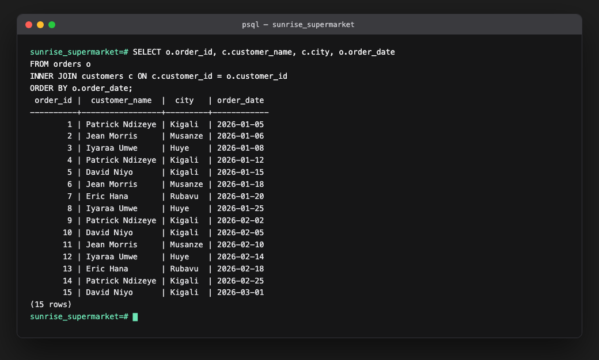
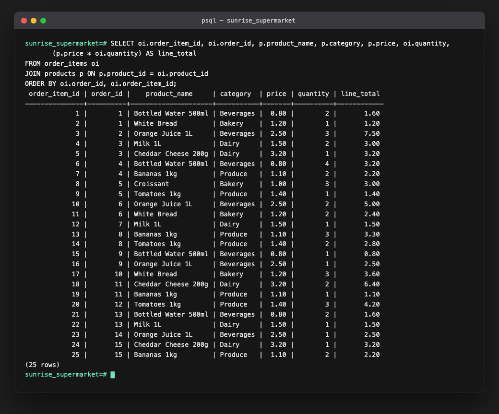
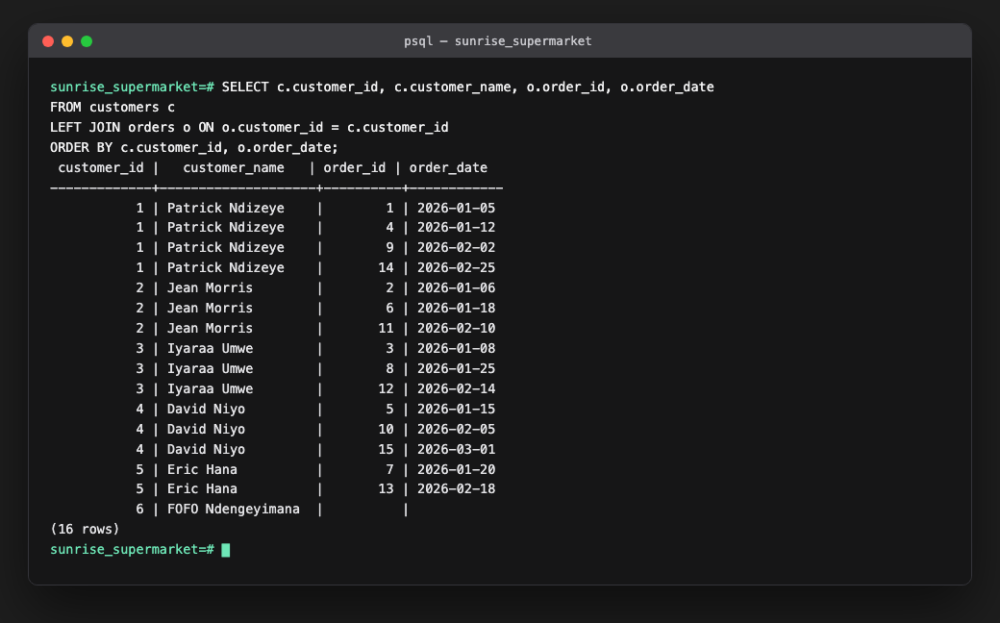
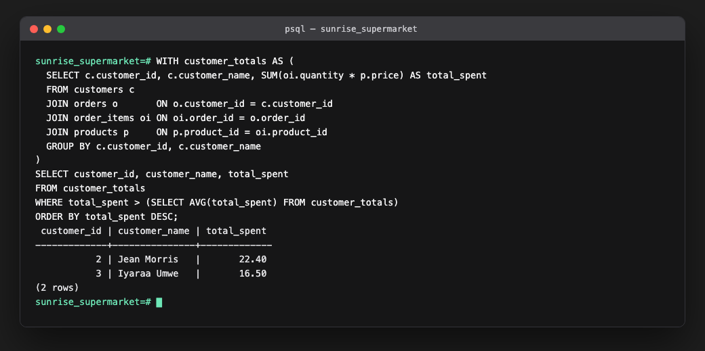
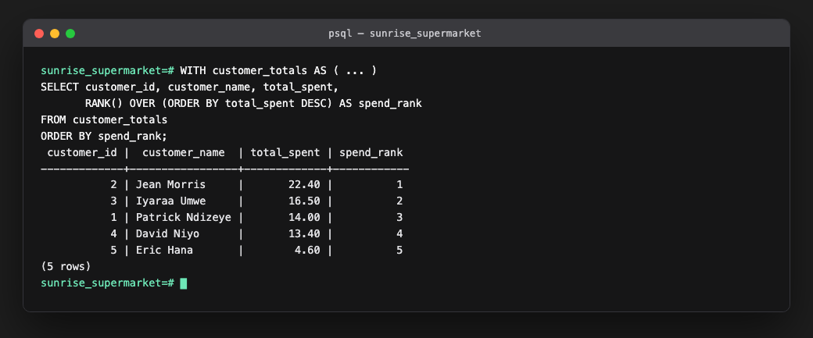
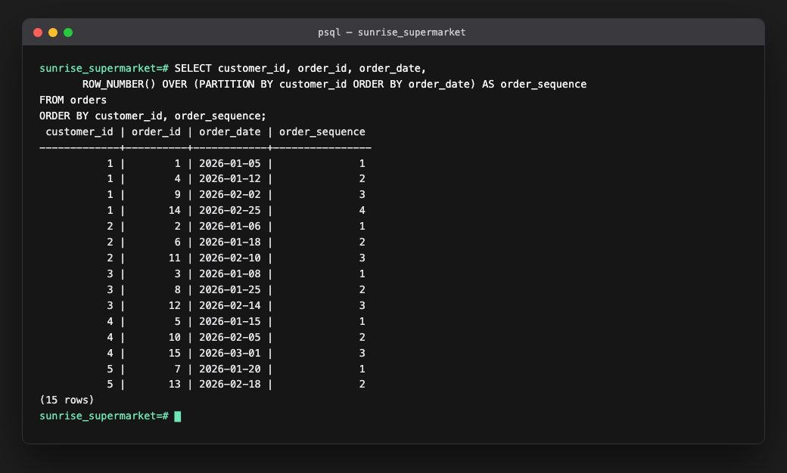
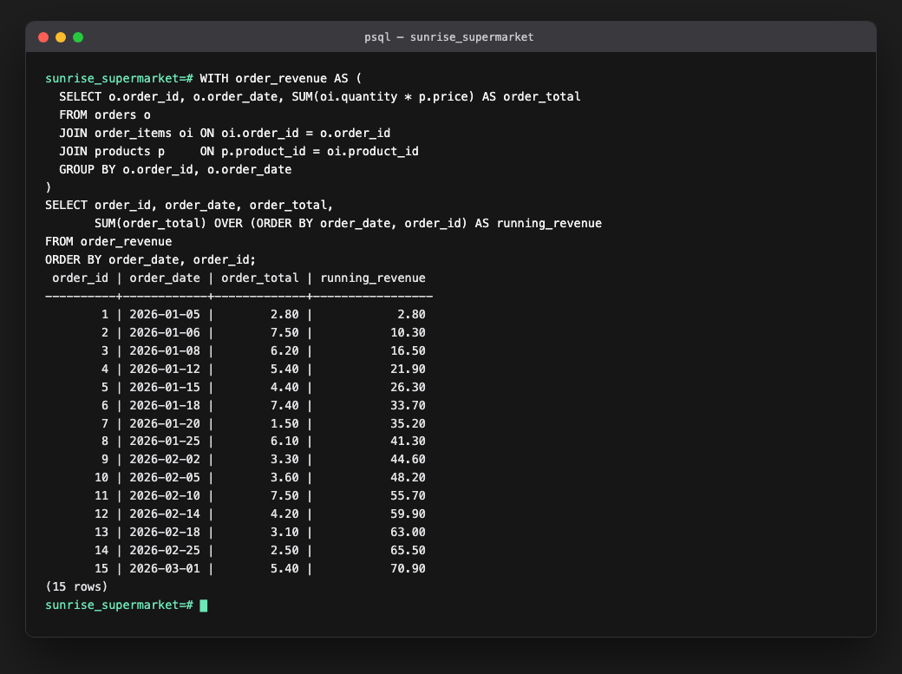
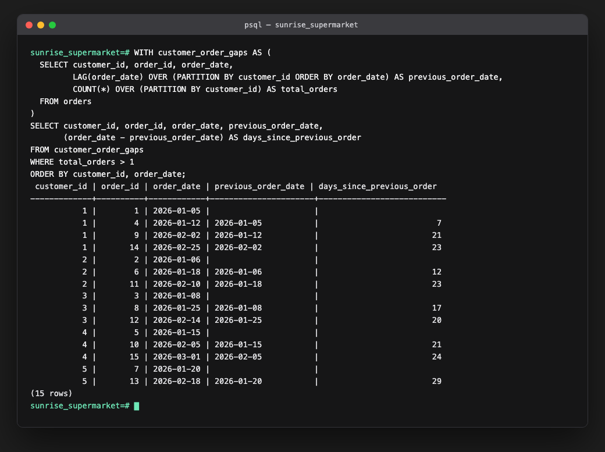

# Sunrise Supermarket 
## SQL Assignment 1

Patrick Ndizeye, 20251SEN120

DBMS: PostgreSQL 16.

## What's here

The `customers` / `products` / `orders` / `order_items` schema, filled with sample data, and the required JOIN, CTE, and window-function queries.

- `sql/schema.sql` - table definitions
- `sql/data.sql` - 6 customers, 8 products (4 categories), 15 orders, 25 order items, Jan-Mar 2026
- `sql/queries.sql` - all queries below
- `screenshots/` - psql output for each query

## Run it

```bash
createdb sunrise_supermarket
psql -d sunrise_supermarket -f sql/schema.sql
psql -d sunrise_supermarket -f sql/data.sql
psql -d sunrise_supermarket -f sql/queries.sql
```

## Scenario

Sunrise Supermarket wants to know who its customers are, what they buy, and whether sales are growing. Customers place orders, each order has one or more line items (a product and a quantity).

I added a sixth customer, Fofo Ndengeyimana, with no orders. With only the required 5 customers, all of whom order something, the LEFT JOIN query would look identical to an inner join, so this proves it actually works.

## JOIN queries

### 1. Every order with customer name, city, order date

```sql
SELECT o.order_id, c.customer_name, c.city, o.order_date
FROM orders o
INNER JOIN customers c ON c.customer_id = o.customer_id
ORDER BY o.order_date;
```

Inner join since every order has a valid customer_id (FK constraint), nothing to preserve on either side.



Kigali customers (me and David) place the most orders in this batch.

### 2. Every order item with product, category, price, quantity

```sql
SELECT oi.order_item_id, oi.order_id, p.product_name, p.category, p.price, oi.quantity,
       (p.price * oi.quantity) AS line_total
FROM order_items oi
JOIN products p ON p.product_id = oi.product_id
ORDER BY oi.order_id, oi.order_item_id;
```

Joins line items to the product catalog, `line_total` is price times quantity.



Beverages and Dairy items carry the highest line totals even at low quantities, since they're priced higher than Bakery/Produce.

### 3. All customers and their orders, including customers with none

```sql
SELECT c.customer_id, c.customer_name, o.order_id, o.order_date
FROM customers c
LEFT JOIN orders o ON o.customer_id = c.customer_id
ORDER BY c.customer_id, o.order_date;
```

LEFT JOIN keeps every customer row even without a matching order.



Fofo shows up with nulls on the order side. An inner join would have dropped him entirely, which matters if marketing wants a list of customers to re-engage.

## CTE query

### Customers spending above the average

```sql
WITH customer_totals AS (
  SELECT c.customer_id, c.customer_name, SUM(oi.quantity * p.price) AS total_spent
  FROM customers c
  JOIN orders o       ON o.customer_id = c.customer_id
  JOIN order_items oi ON oi.order_id = o.order_id
  JOIN products p     ON p.product_id = oi.product_id
  GROUP BY c.customer_id, c.customer_name
)
SELECT customer_id, customer_name, total_spent
FROM customer_totals
WHERE total_spent > (SELECT AVG(total_spent) FROM customer_totals)
ORDER BY total_spent DESC;
```

The CTE computes each customer's total spend first, then the outer query filters against the average of those totals (not against raw order-item rows, which would skew toward customers with more line items).



Average spend is 14.18. Jean Morris and Iyaraa Umwe clear it and are the two customers worth prioritizing for a loyalty program. Eric Hana's total (4.60) is well under average, a clear low-engagement customer.

## Window-function queries

### 1. Rank customers by total spend

```sql
WITH customer_totals AS ( ... )
SELECT customer_id, customer_name, total_spent,
       RANK() OVER (ORDER BY total_spent DESC) AS spend_rank
FROM customer_totals
ORDER BY spend_rank;
```

Same totals as the CTE query, `RANK()` turns it into a leaderboard.



Instant top-spender list for a VIP program, no manual sorting needed.

### 2. Number each customer's orders in the order placed

```sql
SELECT customer_id, order_id, order_date,
       ROW_NUMBER() OVER (PARTITION BY customer_id ORDER BY order_date) AS order_sequence
FROM orders
ORDER BY customer_id, order_sequence;
```

`PARTITION BY customer_id` restarts the count per customer.



Useful for comparing a customer's first order against their later ones, e.g. does basket size grow.

### 3. Running total of revenue over time

```sql
WITH order_revenue AS (
  SELECT o.order_id, o.order_date, SUM(oi.quantity * p.price) AS order_total
  FROM orders o
  JOIN order_items oi ON oi.order_id = o.order_id
  JOIN products p     ON p.product_id = oi.product_id
  GROUP BY o.order_id, o.order_date
)
SELECT order_id, order_date, order_total,
       SUM(order_total) OVER (ORDER BY order_date, order_id) AS running_revenue
FROM order_revenue
ORDER BY order_date, order_id;
```

Each order's total gets computed first, then accumulated with a running `SUM() OVER (ORDER BY order_date)`.



Total revenue reaches 70.90 by March 1. This is the exact shape a revenue-over-time chart needs, computed directly in SQL.

### 4. Days between a customer's orders

```sql
WITH customer_order_gaps AS (
  SELECT customer_id, order_id, order_date,
         LAG(order_date) OVER (PARTITION BY customer_id ORDER BY order_date) AS previous_order_date,
         COUNT(*) OVER (PARTITION BY customer_id) AS total_orders
  FROM orders
)
SELECT customer_id, order_id, order_date, previous_order_date,
       (order_date - previous_order_date) AS days_since_previous_order
FROM customer_order_gaps
WHERE total_orders > 1
ORDER BY customer_id, order_date;
```

`LAG()` pulls each customer's previous order date so it can be subtracted from the current one. `COUNT(*) OVER (...)` filters out anyone with a single order (nobody here, but the query needs to hold up in general). A customer's first order naturally has no previous order to compare, hence the null.



## Challenges

- No Oracle installed locally, so I ported the DDL to Postgres types (`NUMBER` to `INTEGER`/`NUMERIC`, `VARCHAR2` to `VARCHAR`) and ran everything against a real database instead of submitting untested SQL.
- With just the required 5 customers, LEFT JOIN vs INNER JOIN would look identical since everyone has orders. Added a 6th customer with none so it actually proves something.
- Filtered the CTE's average against `AVG(total_spent)` from the same CTE, not from raw order-item rows, so customers with more line items don't skew the average.
